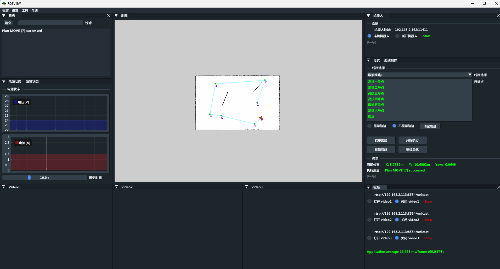

## RosView

A simple app for ros nav, base on [rosserial](https://wiki.ros.org/rosserial) and dear [imgui](https://github.com/ocornut/imgui/tree/docking) for windows.

### About rosserial

The number of Publishers and Subscribers are limited at 25, and the size of serialization and deserialization buffers are limited at 512 bytes by default for [rosserial_client](https://wiki.ros.org/rosserial_client).

| **AVR Model** | **Input/Output buffer sizes** | **Publishers/Subscribers** |
| ------------- | ----------------------------- | -------------------------- |
| ATMEGA168     | 150/150 bytes                 | 6/6                        |
| ATMEGA328P    | 280/280 bytes                 | 25/25                      |
| All others    | 512/512 bytes                 | 25/25                      |

## build

```
mkdir build
cd build && cmake ..
MSBuild.exe RosView.sln -p:Configuration=Release

build to
build/output/Release/RosView.exe
```


